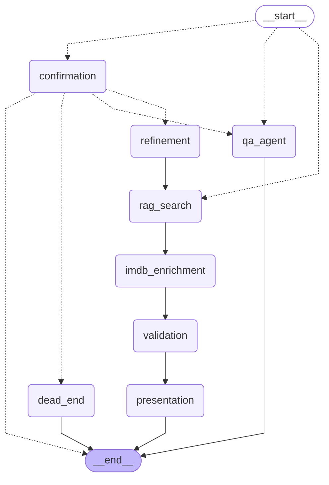

# Movie Finder — Chain Diagram

> Auto-generated by `scripts/generate_diagram.py`. Do **not** edit by hand.

```mermaid
---
config:
  flowchart:
    curve: linear
---
graph TD;
	__start__([<p>__start__</p>]):::first
	rag_search(rag_search)
	imdb_enrichment(imdb_enrichment)
	validation(validation)
	presentation(presentation)
	confirmation(confirmation)
	refinement(refinement)
	qa_agent(qa_agent)
	dead_end(dead_end)
	__end__([<p>__end__</p>]):::last
	__start__ -.-> confirmation;
	__start__ -.-> qa_agent;
	__start__ -.-> rag_search;
	confirmation -.-> __end__;
	confirmation -.-> dead_end;
	confirmation -.-> qa_agent;
	confirmation -.-> refinement;
	imdb_enrichment --> validation;
	rag_search --> imdb_enrichment;
	refinement --> rag_search;
	validation --> presentation;
	dead_end --> __end__;
	presentation --> __end__;
	qa_agent --> __end__;
	classDef default fill:#f2f0ff,line-height:1.2
	classDef first fill-opacity:0
	classDef last fill:#bfb6fc

```
