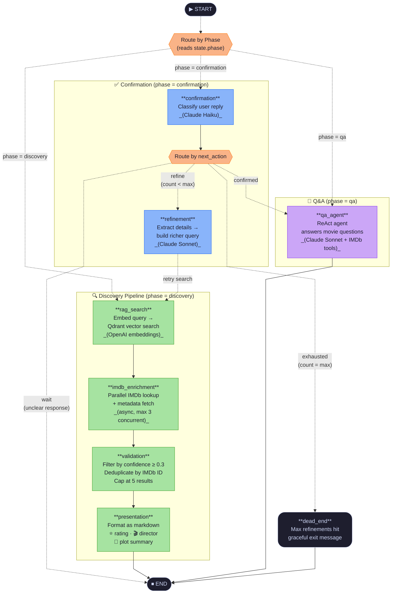

# Movie Finder — Annotated Chain Diagram

> **How to read this diagram**
> - Solid arrows `-->` = deterministic edges (always taken)
> - Dashed arrows `-.->` = conditional edges (router decides at runtime)
> - Boxes with rounded corners = processing nodes
> - Parallelograms = decision/routing nodes
> - Pill shapes = start / end terminals
> - Node colour = phase it belongs to

---

## Full Graph



---

## Phase-by-phase walkthrough

### Phase 1 — Discovery `(initial state)`

```
User: "A sci-fi movie about AI taking over"
    │
    ▼
rag_search      → embeds the plot description with text-embedding-3-large
                  → queries Qdrant for the top-8 closest vectors
    │
    ▼
imdb_enrichment → fires up to 3 concurrent IMDb search requests per RAG hit
                  → fetches title / year / rating / director / genre / plot
    │
    ▼
validation      → drops results with confidence < 0.3
                  → deduplicates by IMDb ID (same film via different RAG hits)
                  → caps the final list at 5 candidates
    │
    ▼
presentation    → renders a numbered markdown list with ⭐ ratings, 🎬 directors,
                  📖 short plot summaries
                  → sets state.phase = "confirmation"
```

### Phase 2 — Confirmation `(next user message)`

```
User: "Yes! Number 2 looks right"
    │
    ▼
confirmation    → Claude Haiku classifies the reply into one of:
                    confirmed   → user picked a movie
                    not_found   → none matched → increment refinement_count
                    unclear     → ambiguous → ask for clarification (wait)
    │
    ├─ confirmed  → qa_agent (phase → "qa")
    │
    ├─ refine     → refinement
    │                  → Claude Sonnet extracts all conversation details
    │                  → builds a richer semantic search query
    │               → rag_search (loops back into discovery pipeline)
    │
    ├─ exhausted  → dead_end  (refinement_count = max_refinements)
    │
    └─ wait       → END  (bot asks for clarification)
```

### Phase 3 — Q&A `(all subsequent messages)`

```
User: "Who directed it? Is it on Netflix?"
    │
    ▼
qa_agent        → Claude Sonnet ReAct agent
                  → has access to IMDb tools (search, get_movie_details)
                  → loops tool-call / observe until the answer is complete
                  → returns a conversational reply
```

---

## State transitions summary

| From phase | Trigger | To phase |
|---|---|---|
| discovery | presentation completes | confirmation |
| confirmation | user confirms a movie | qa |
| confirmation | unclear response | confirmation (wait for clarification) |
| confirmation | no match + count < max | confirmation (after refinement loop) |
| confirmation | no match + count = max | — (dead end) |
| qa | every subsequent message | qa (infinite loop) |

---

## Component reference

| Node | Model / Service | Role |
|---|---|---|
| `rag_search` | OpenAI `text-embedding-3-large` + Qdrant | Semantic vector search |
| `imdb_enrichment` | IMDb API (async, rate-limited) | Enrich candidates with metadata |
| `validation` | Pure Python | Filter, deduplicate, rank |
| `presentation` | Pure Python | Format for the user |
| `confirmation` | Claude Haiku | Lightweight intent classification |
| `refinement` | Claude Sonnet | Query improvement from context |
| `qa_agent` | Claude Sonnet + IMDb tools | Open-ended movie Q&A |
| `dead_end` | Pure Python | Graceful exit after max retries |
